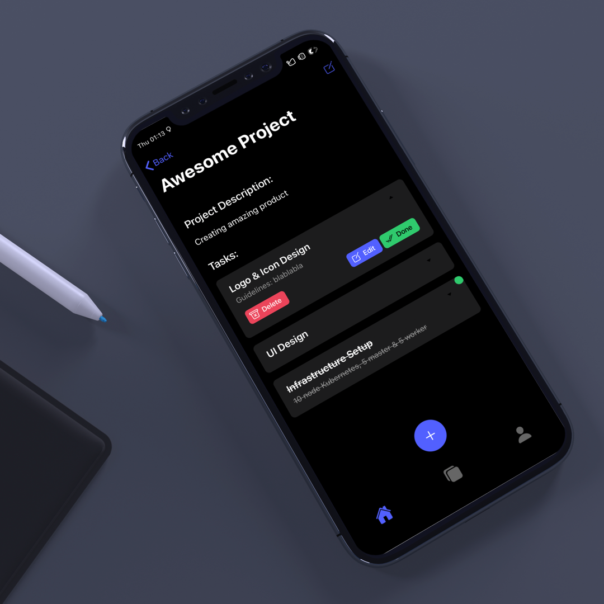
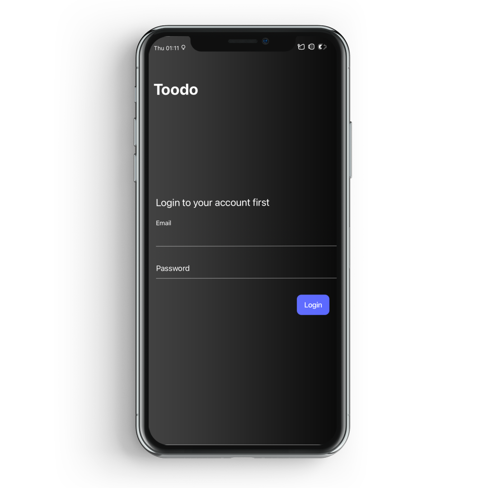
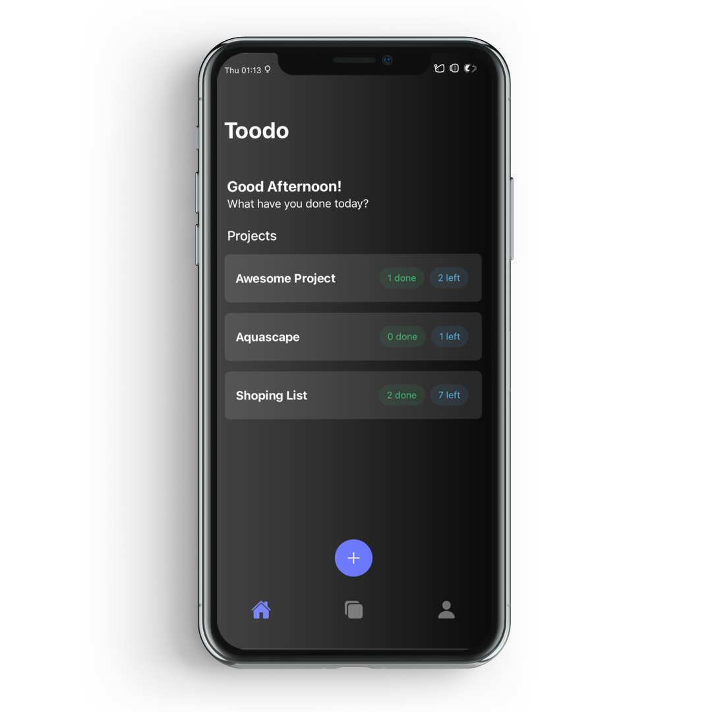
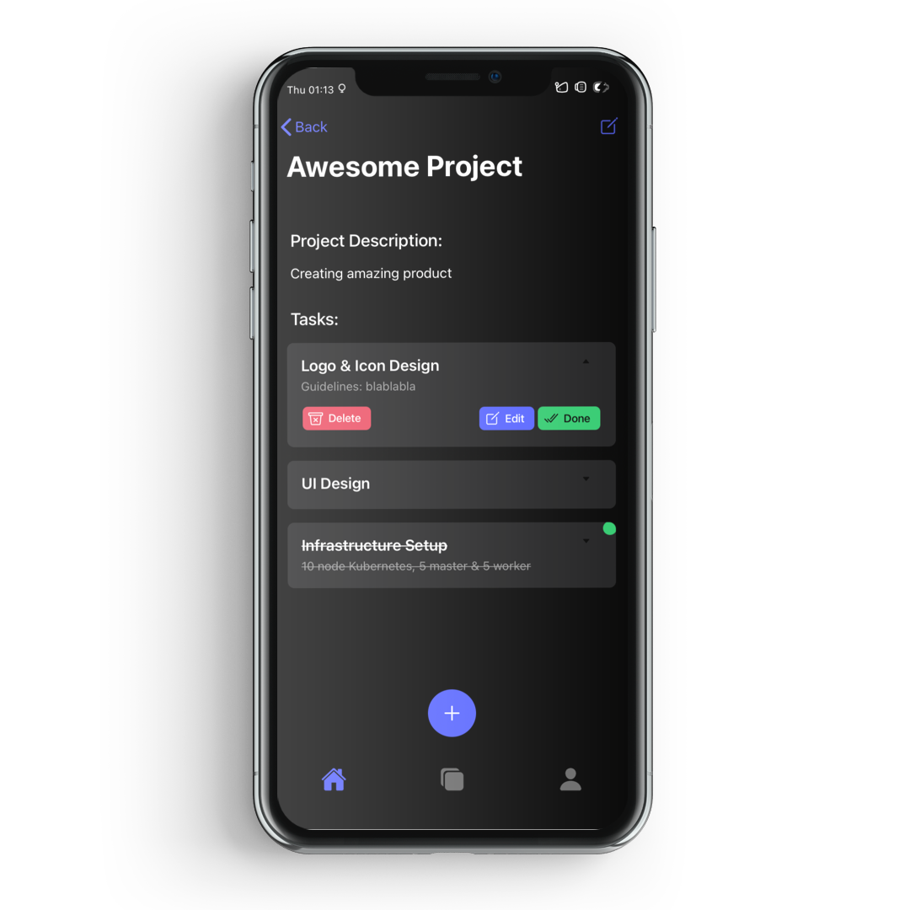
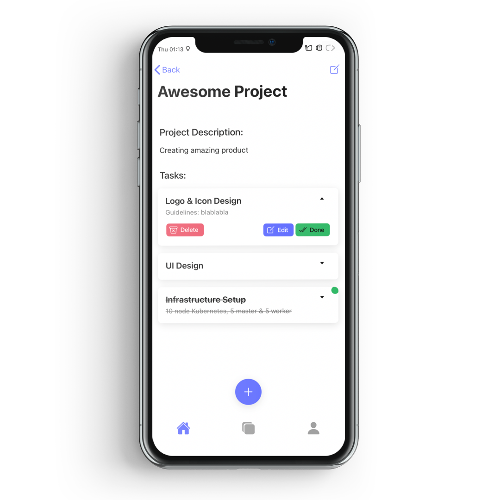
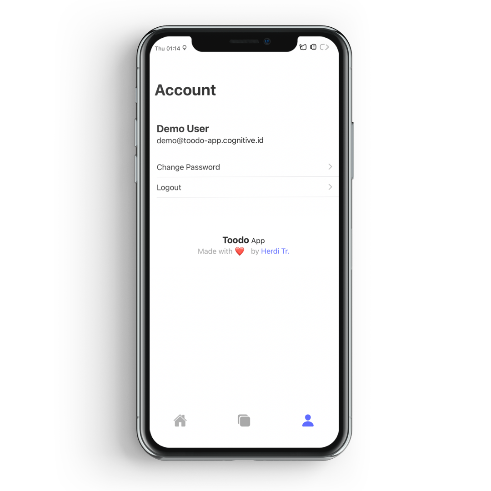
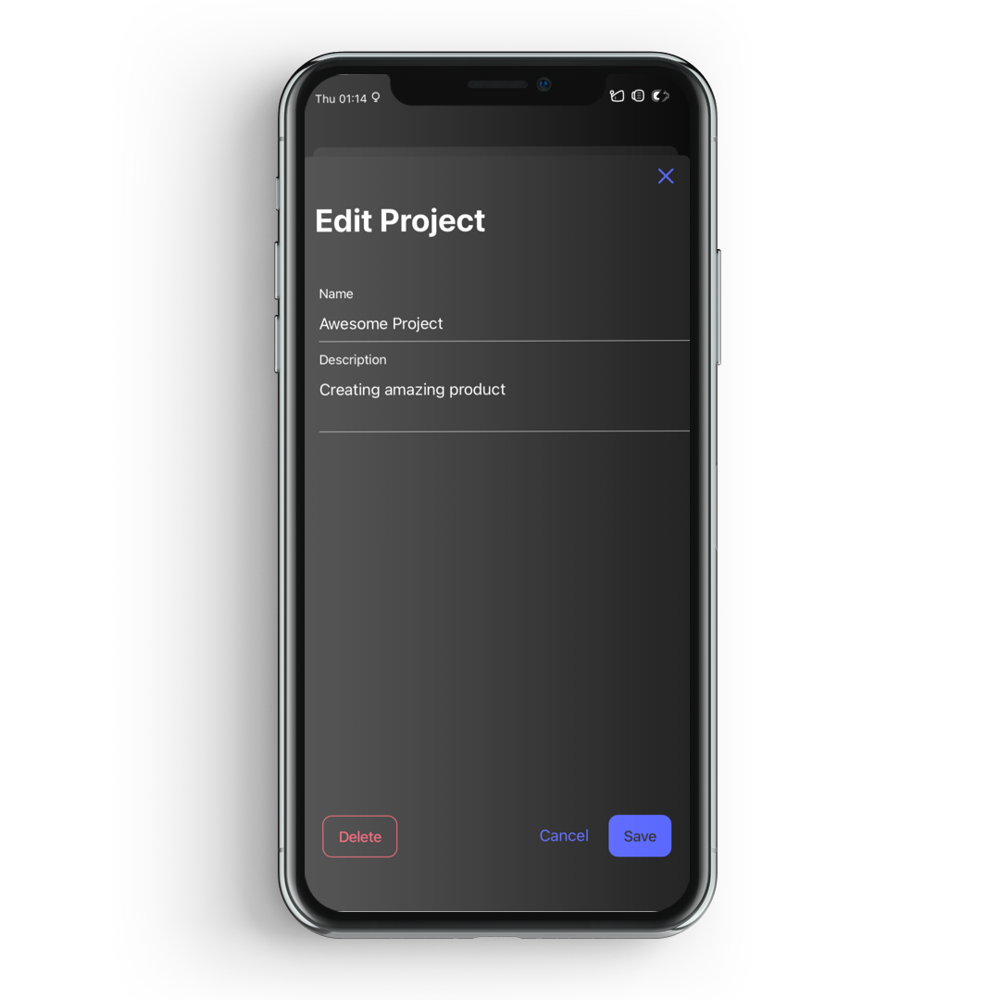
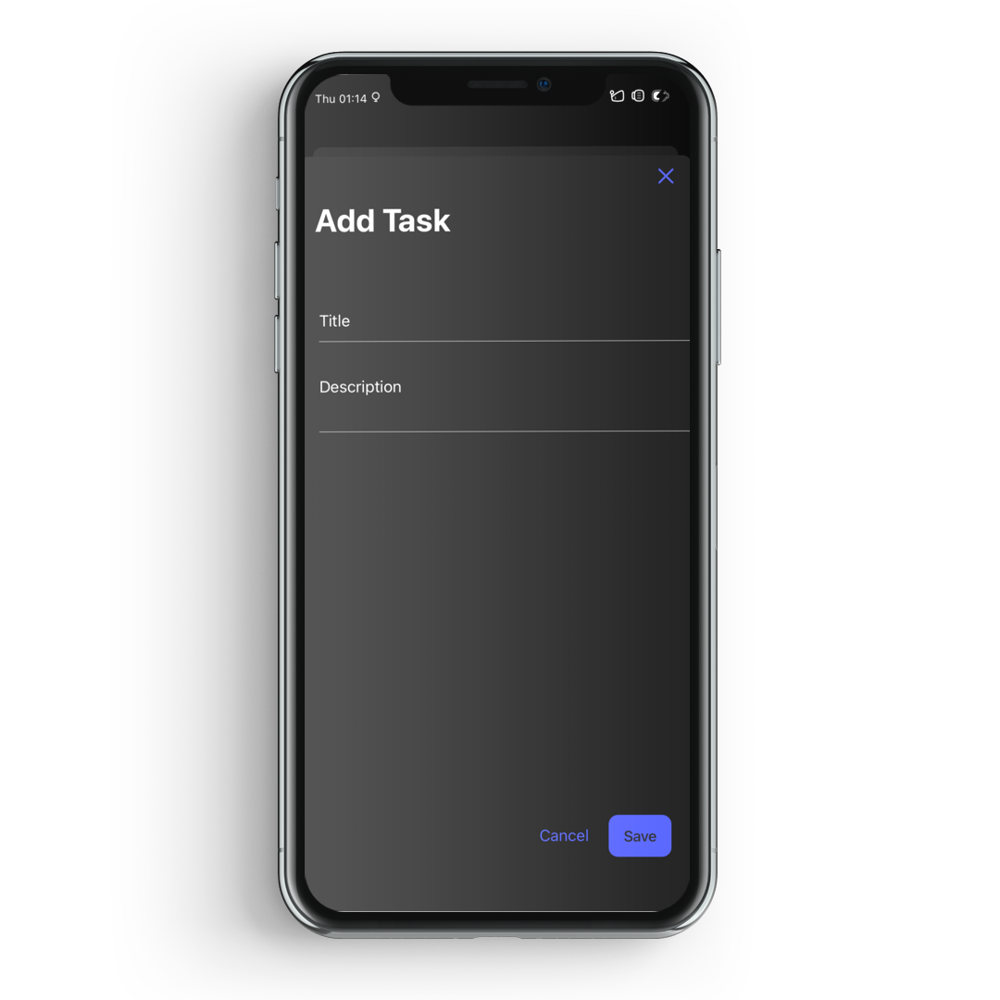

# Toodo

This project was done during #30daysofappwrite event. The back-end of this project uses Appwrite, an open-source back-end as a service.

Toodo, yes, like most other todo apps. boring.

## Tech-Stack

1. Ionic-Vue
2. Appwrite

## Features

1. Login/Signup with Email (Appwrite Auth)
2. Change Password (Appwrite Auth)
3. Manage Projects (Appwrite Database)
4. Manage Tasks (Appwrite Databases)

## Screenshots

<pre>
   
   
   
   
   
   
  
</pre>

## PWA Build Demo

Link: <https://toodo-app.cognitive.id>

- Login Email: demo@toodo-app.cognitive.id
- Password: demo1234
